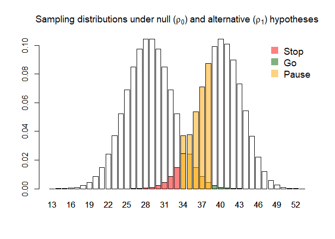

<!-- README.md is generated from README.Rmd. Please edit that file -->

# tout

<!-- badges: start -->

[](https://github.com/DTWilson/tout/actions/workflows/R-CMD-check.yaml)
<!-- badges: end -->

The goal of tout is to optimise the design of **t**hree-**out**come
clinical trials by determining their sample size and progression
criteria.

## Installation

You can install the development version of tout from
[GitHub](https://github.com/) with:

``` r
# install.packages("devtools")
devtools::install_github("DTWilson/tout")
```

## Example

Consider a pilot trial which will measure the proportion of patients, in
the intervention arm, who adhere to the intervention. We want to use
this estimate of the probability of adherence (denoted $\rho$) in a
statistical test with three possible outcomes: stop, go, or pause (where
a pause outcome allows us to make the progression decision outwith the
testing framework, based on other information and/or stakeholders).

Let the null and alternative hypotheses be $\rho_0 = 0.5$ and
$\rho_1 = 0.7$, and suppose we wish to control error rates at
$\alpha \leq 0.05, \beta \leq 0.2$ and $\gamma \leq 0.6$. We can find
the smallest possible design satisfying these constraints using the
`tout_design()` function:

``` r
library(tout)

design <- tout_design(rho_0 = 0.5, rho_1 = 0.7, alpha_nom = 0.05, beta_nom = 0.2, gamma_nom = 0.6)

design
#> Three-outcome design
#> 
#> Sample size: 57 
#> Decision thresholds: 33 38 
#> 
#> alpha = 0.04808966 
#> beta = 0.186012 
#> gamma = 0.5433195 
#> 
#> Hypotheses: 0.5 (null), 0.7 (alternative)
#> Modification effect range: 0 0 
#> Error probability following an intermediate result: 0.5 0.5
```

Plotting the returned object gives an illustration of the sampling
distribution of the estimated adherence probability under each
hypothesis, along side the optimal progression criteria and the
decisions they will lead to:

``` r
plot(design)
```



The same function can be used when we anticipate making some adjustments
following a pause outcome (see the `tau` argument); when assuming
particular probabilities of making correct decisions following a pause
outcome (see the `eta` argument); and when the outcome is continuous
rather than binary (see the `sigma` argument). Furhter details can be
found in the vingette and in the associated manuscript.
