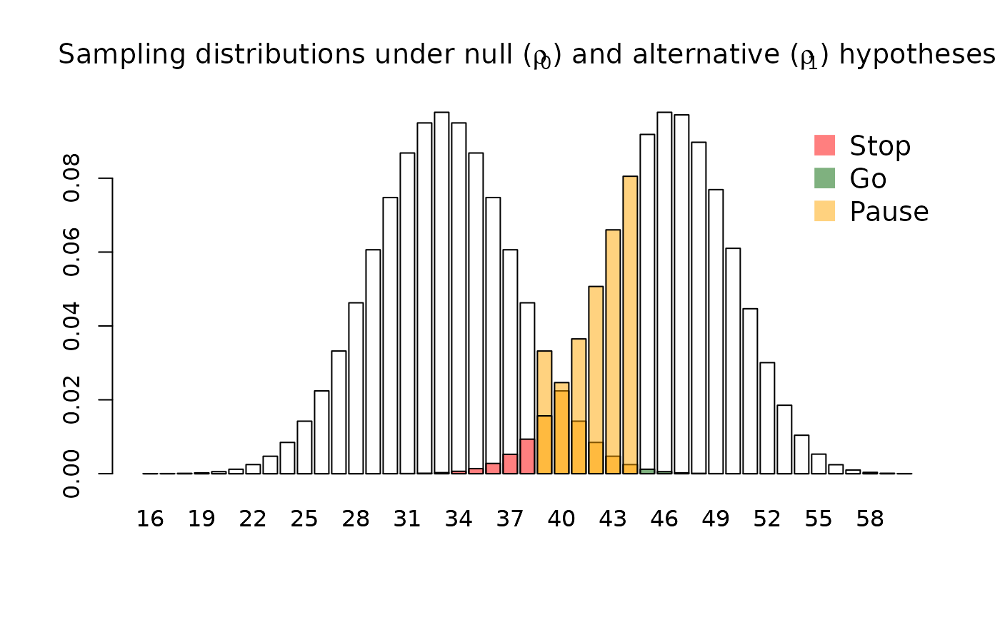

# Three-outcome clinical trial design (tout)

``` r
library(tout)
```

## Introduction

Early phase clinical trials typically employ a hypothesis test as their
primary analysis, with this test having two possible outcomes: we will
either **go** to the next stage of evaluation (e.g. a large phase III
trial), or we will **stop** development. In a testing framework these
decisions correspond with the rejection of the null hypothesis, or the
failure to reject it, respectively.

Some authors have suggested that phase II drug trials can extend this
approach to allow for a third intermediate outcome, where we **pause**
if we observe data that is not so bad as to warrant an immediate stop,
nor so good as to warrant an immediate go. A similar approach is very
common in pilot trials of complex interventions. In both settings, the
mechanics are the same: we compute an estimate $\widehat{\rho}$ of the
parameter of interest, $\rho$, and compare it against two thresholds,
$x_{0}$ and $x_{1}$, such that

$$\text{Decision} = \begin{cases}
\text{go} & {{\mspace{6mu}\text{if}\mspace{6mu}}\widehat{\rho} \geq x_{1}} \\
\text{pause} & {{\mspace{6mu}\text{if}\mspace{6mu}}x_{0} < \widehat{\rho} < x_{1}} \\
\text{stop} & {{\mspace{6mu}\text{if}\mspace{6mu}}\widehat{\rho} < x_{0}.} \\
 & 
\end{cases}$$

The `tout` package lets us determine optimal values for the decision
thresholds $x_{0}$ and $x_{1}$ and the sample size $n$. In particular,
it will find the smallest possible trial which will satisfy constraints
on the following three operating characteristics:

- $\alpha$, the probability of proceeding to the main trial when
  $\rho \leq \rho_{0}$;
- $\beta$, the probability of not proceeding to the main trial when
  $\rho \geq \rho_{1}$; and
- $\gamma$, the probability of making an immediate stop or go decision
  when $\rho = \left( \rho_{0} + \rho_{1} \right)/2$.

## A simple example

Suppose the parameter of interest, $\rho$, is the probability of
adherence in the intervention arm of a pilot trial. Suppose further that
our null and alternative hypotheses are $\rho_{0} = 0.5$ and
$\rho_{1} = 0.7$, respectively. Using typical type I and II error
constraints, $\alpha \leq 0.05$ and $\beta \leq 0.2$, we can find the
smallest design that will ensure a probability of at least
$1 - \gamma = 0.5$ that we will obtain a pause decision if the true
parameter value is midway between the null and alternative hypotheses:

``` r
design <- tout_design(rho_0 = 0.5, rho_1 = 0.7, alpha_nom = 0.05, beta_nom  = 0.2, gamma_nom = 0.5)

design
#> Three-outcome design
#> 
#> Sample size: 66 
#> Decision thresholds: 38 44 
#> 
#> alpha = 0.04488955 
#> beta = 0.1703036 
#> gamma = 0.496394 
#> 
#> Hypotheses: 0.5 (null), 0.7 (alternative)
#> Modification effect range: 0 0 
#> Error probability following an intermediate result: 0.5 0.5
```

We can visualise the sampling distribution of the test statistic under
each hypothesis, highlighting the decisions which will be made:

``` r
plot(design)
```



## Making decisions following a pause outcome

The testing framework employed in `tout` acknowledges that a final
stop/go decision must be made following a pause outcome, and factors
this into the calculation of error rates. This requires an assumption
about how well such decisions will be made; in particular, we must
estimate the probabilities that we will incorrectly go when
$\rho \leq \rho_{0}$ (denoted $\eta_{0}$), and that we will incorrectly
stop when $\rho \geq \rho_{1}$ (denoted $\eta_{1}$). By default,
[`tout_design()`](https://dtwilson.github.io/tout/reference/tout_design.md)
assumes that $\eta_{0} = \eta_{1} = 0.5$, but we can change these if we
wish:

``` r
design <- tout_design(rho_0 = 0.5, rho_1 = 0.7, alpha_nom = 0.05, beta_nom  = 0.2, gamma_nom = 0.5, eta_0 = 0.3, eta_1 = 0.4)

design
#> Three-outcome design
#> 
#> Sample size: 46 
#> Decision thresholds: 26 31 
#> 
#> alpha = 0.0492724 
#> beta = 0.1830351 
#> gamma = 0.4863821 
#> 
#> Hypotheses: 0.5 (null), 0.7 (alternative)
#> Modification effect range: 0 0 
#> Error probability following an intermediate result: 0.3 0.4
```

## Making adjustments following a pause outcome

We often anticipate making some adjustments to the intervention and/or
the trial design following a pause outcome, in an attempt to improve the
parameter of interest and ensure the subsequent trial is successful. We
can incorporate this in `tout` if we can specify an interval for the
effect of this modification
$\tau \in \left\lbrack \tau_{min},\tau_{max} \right\rbrack$. For
example, suppose we anticipate an improvement in adherence in the range
of $\tau \in \lbrack 0.01,0.05\rbrack$. The optimal design is then

``` r
design <- tout_design(rho_0 = 0.5, rho_1 = 0.7, alpha_nom = 0.05, beta_nom  = 0.2, gamma_nom = 0.5, tau = c(0.01, 0.05))

design
#> Three-outcome design
#> 
#> Sample size: 100 
#> Decision thresholds: 55 63 
#> 
#> alpha = 0.04924659 
#> beta = 0.1988391 
#> gamma = 0.4732802 
#> 
#> Hypotheses: 0.5 (null), 0.7 (alternative)
#> Modification effect range: 0.01 0.05 
#> Error probability following an intermediate result: 0.5 0.5
```

## Designs for continuous endpoints

By default,
[`tout_design()`](https://dtwilson.github.io/tout/reference/tout_design.md)
assumes a binary endpoint. We can find designs for continuous endpoints
if we supply the (assumed known) standard deviation of the outcome via
the `sigma` argument. For example,

``` r
design <- tout_design(rho_0 = 2, rho_1 = 5, alpha_nom = 0.05, beta_nom  = 0.2, gamma_nom = 0.5, sigma = 7, tau = c(1, 2), max_n = 500)

design
#> Three-outcome design
#> 
#> Sample size: 179 
#> Decision thresholds: -0.6286741 1.644913 
#> 
#> alpha = 0.05 
#> beta = 0.2002572 
#> gamma = 0.3147751 
#> 
#> Hypotheses: 2 (null), 5 (alternative)
#> Standard deviation: 7 
#> Modification effect range: 1 2 
#> Error probability following an intermediate result: 0.5 0.5
```

Note that the decision thresholds are given on the scale of the
z-statistic.

## Further details

For the case of a binary endpoint, the three error rates are formally
defined as:

$$\begin{aligned}
{\alpha =} & {\max\lbrack\Pr\left( x_{1} < \widehat{\rho}\ |\ \rho = \rho_{0} \right),\ \eta\Pr\left( x_{0} < \widehat{\rho} \leq x_{1}\ |\ \rho = \rho_{0} - \tau_{min} \right)} \\
 & {+ \Pr\left( x_{1} < \widehat{\rho}\ |\ \rho = \rho_{0} - \tau_{min} \right)\rbrack} \\
{\beta =} & {\Pr\left( \widehat{\rho} \leq x_{0}\ |\ \rho = \rho_{1} - \tau_{max} \right) + \eta\Pr\left( x_{0} < \widehat{\rho} \leq x_{1}\ |\ \rho = \rho_{1} - \tau_{max} \right)} \\
{\gamma =} & {\Pr\left( \widehat{\rho} \leq x_{0}\ |\ \rho = \left\lbrack \rho_{0} + \rho_{1} - \tau_{min} - \tau_{max} \right\rbrack/2 \right)} \\
 & {+ \Pr\left( x_{1} < \widehat{\rho}\ |\ \rho = \left\lbrack \rho_{0} + \rho_{1} - \tau_{min} - \tau_{max} \right\rbrack/2 \right).}
\end{aligned}$$

Derivations of these are given in the associated manuscript. The case of
continuous endpoints follows, now considering the test statistic to be a
z-statistic with distribution

$$Z \sim N\left( \frac{\rho - \rho_{0}}{\sqrt{\sigma^{2}/n}},1 \right).$$

Given any $n$ and $x_{1}$, the $x_{0}$ corresponding to the nominal
constraint on $\alpha$ can be found exactly. The optimal $x_{1}$ is
determined numerically (using an exhaustive search in the binary case
and [`optimize()`](https://rdrr.io/r/stats/optimize.html) in the
continuous case) with respect to the nominal constraint on $\beta$.
Finally, a bisection search is used to find the lowest $n$ which
satisfies the nominal constraint on $\gamma$.

## References

- Wilson, D.T., Hudson, E. & Brown, S. Three-outcome designs for
  external pilot trials with progression criteria. *BMC Med Res
  Methodol* 24, 226 (2024). <https://doi.org/10.1186/s12874-024-02351-x>
